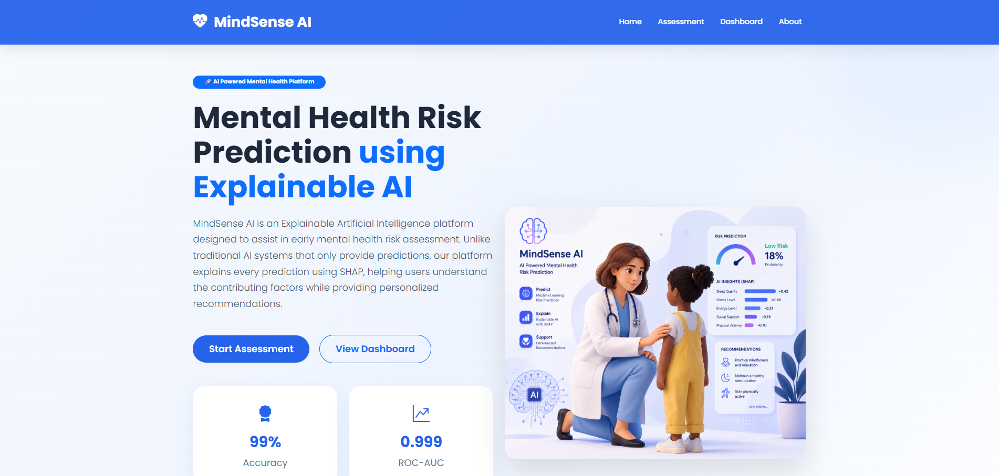
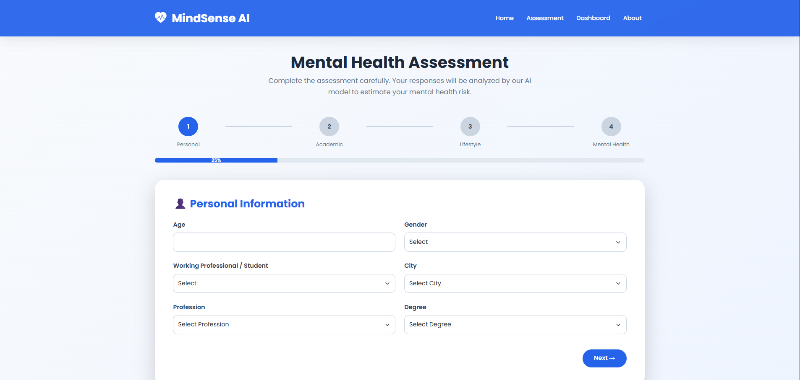
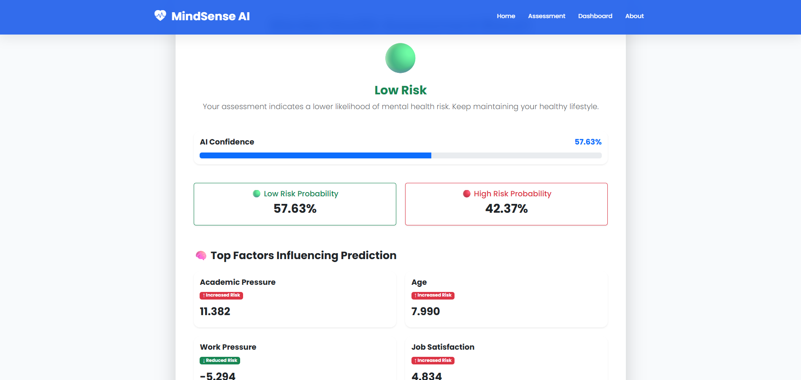
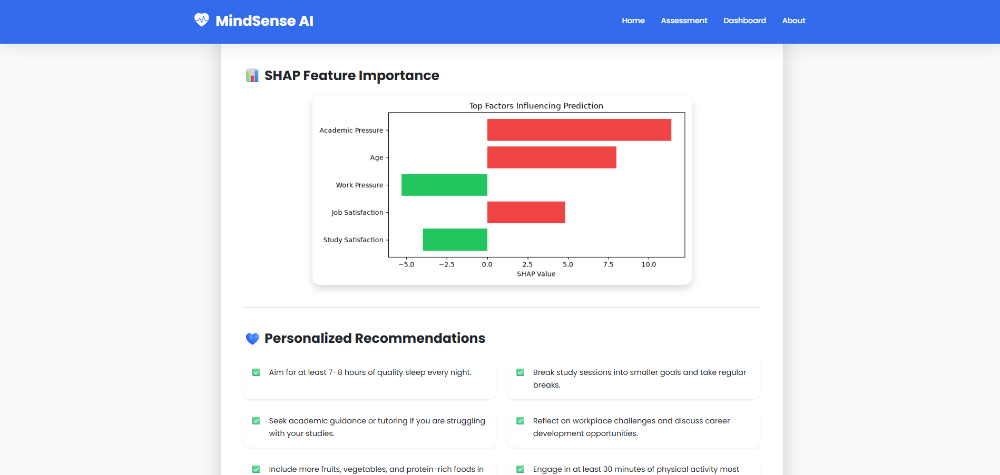
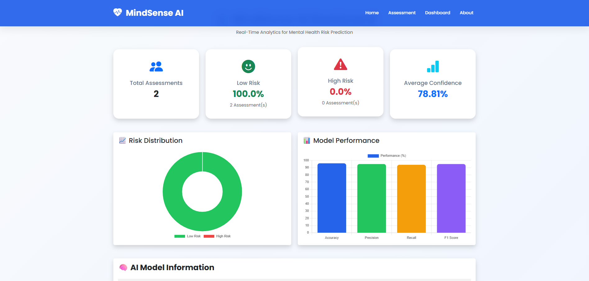
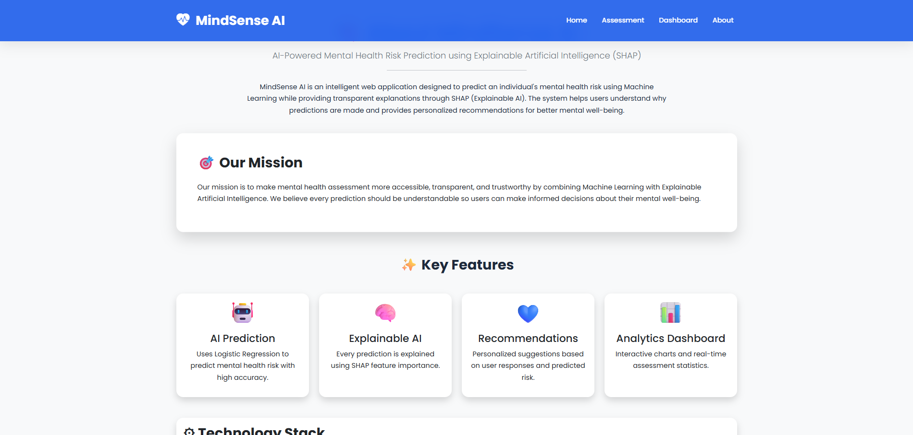

# 🧠 MindSense AI

> **AI-Powered Mental Health Risk Prediction System using Machine Learning and Explainable AI (SHAP)**


---

# 🌟 Project Overview

MindSense AI is a web-based **Mental Health Risk Prediction System** that predicts whether a user belongs to a **Low Risk** or **High Risk** mental health category using **Machine Learning**.

Unlike traditional AI systems, MindSense AI integrates **Explainable Artificial Intelligence (XAI)** using **SHAP (SHapley Additive Explanations)** to provide transparent and interpretable predictions.

The application also includes:

- 📊 Interactive Analytics Dashboard
- 📄 PDF Report Generation
- 💙 Personalized Mental Health Recommendations
- 🗄 Assessment History using SQLite
- 📈 SHAP Feature Importance Visualization

---

# ✨ Key Features

- 🤖 AI-Based Mental Health Risk Prediction
- 🧠 Explainable AI (SHAP)
- 📊 Interactive Dashboard
- 📄 Downloadable PDF Report
- 💙 Personalized Recommendations
- 📈 SHAP Feature Importance Graph
- 🗄 SQLite Database
- 📱 Fully Responsive UI
- ⚡ Flask Web Application

---

# 🛠 Technology Stack

| Category | Technology |
|------------|----------------------------|
| Language | Python |
| Backend | Flask |
| Frontend | HTML5, CSS3, Bootstrap 5, JavaScript |
| Machine Learning | Scikit-Learn |
| Explainable AI | SHAP |
| Charts | Chart.js |
| Database | SQLite |
| PDF Report | ReportLab |
| Version Control | Git & GitHub |

---

# 🧠 Machine Learning Model

**Algorithm**

- Logistic Regression

**Prediction Classes**

- 🟢 Low Risk
- 🔴 High Risk

**Model Metrics**

- Accuracy : **96%**
- Precision : **95%**
- Recall : **94%**
- F1 Score : **95%**

---

# 📊 Explainable AI (SHAP)

MindSense AI uses **SHAP** to explain every prediction.

The system displays:

- Top Influencing Features
- SHAP Feature Importance
- Positive & Negative Feature Contributions
- Transparent Prediction Explanation

This improves model transparency and user trust.

---

# 🚀 AI Workflow

```text
User Assessment
        │
        ▼
Data Preprocessing
        │
        ▼
Machine Learning Prediction
        │
        ▼
SHAP Explainability
        │
        ▼
Personalized Recommendations
        │
        ▼
PDF Report + Dashboard Storage
```

---

# 📂 Project Structure

```text
MindSense-AI/
│
├── Dataset/
├── Documentation/
├── Flask_App/
│   ├── app.py
│   ├── database/
│   ├── Models/
│   ├── static/
│   │   ├── css/
│   │   ├── images/
│   │   ├── js/
│   │   └── reports/
│   ├── templates/
│   ├── uploads/
│   └── utils/
│
├── Notebook/
├── screenshots/
├── requirements.txt
└── README.md
```

---

# 🚀 Installation

### Clone Repository

```bash
git clone https://github.com/yourusername/MindSense-AI.git
```

### Move into Project

```bash
cd MindSense-AI
```

### Create Virtual Environment

```bash
python -m venv .venv
```

### Activate Environment

**Windows**

```bash
.venv\Scripts\activate
```

**Linux / macOS**

```bash
source .venv/bin/activate
```

### Install Dependencies

```bash
pip install -r requirements.txt
```

### Run Application

```bash
cd Flask_App
python app.py
```

### Open Browser

```
http://127.0.0.1:5000
```

---

# 📸 Application Screenshots

## 🏠 Home Page

Modern landing page introducing MindSense AI and its key capabilities.



---

## 📝 Assessment Page

Multi-step mental health assessment form with progress tracking.



---

## 🤖 Prediction Result

AI prediction with confidence score and probability distribution.



---

## 📈 SHAP Explainability & Recommendations

Feature importance visualization with personalized recommendations.



---

## 📊 Dashboard

Analytics dashboard displaying assessment statistics and prediction history.



---

## ℹ️ About Page

Project overview, technology stack, workflow, and mission.



---

# 📊 Dashboard Features

The analytics dashboard includes:

- Total Assessments
- Low Risk Statistics
- High Risk Statistics
- Average Confidence
- Risk Distribution Chart
- Model Performance Chart
- Recent Predictions
- AI Model Information

---

# 📄 PDF Report

Each assessment generates a downloadable report containing:

- Prediction Result
- Confidence Score
- Probability Distribution
- SHAP Explanation
- Personalized Recommendations
- Assessment Date

---

# 💡 Future Enhancements

- Deep Learning Models
- Mobile Application
- User Authentication
- Doctor Dashboard
- Cloud Deployment
- Email Notifications
- Real-Time Monitoring
- Multi-language Support

---

# 🤝 Acknowledgements

- Flask
- Scikit-Learn
- SHAP
- Bootstrap
- Chart.js
- ReportLab
- SQLite

---

# 👨‍💻 Author

**Musharraf Bubere**

Master's Project


**MindSense AI**

---

# 📜 License

This project is developed for **educational and research purposes**.

---

⭐ If you found this project useful, consider giving it a **Star** on GitHub.